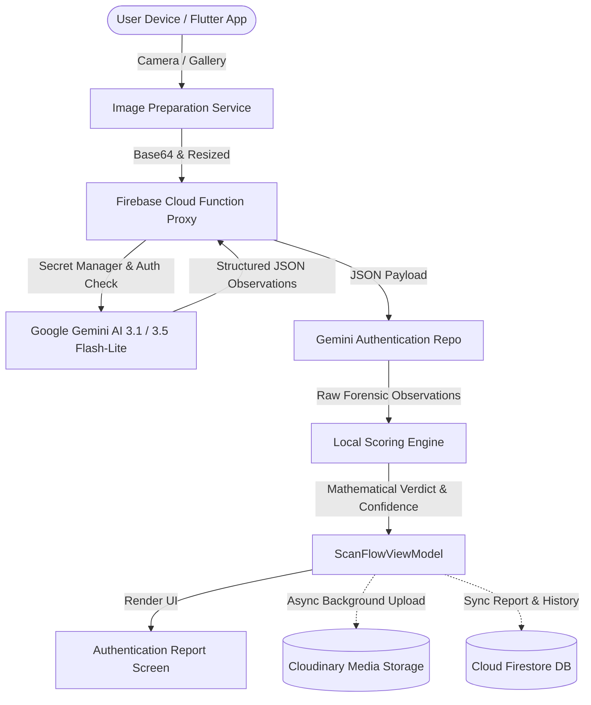
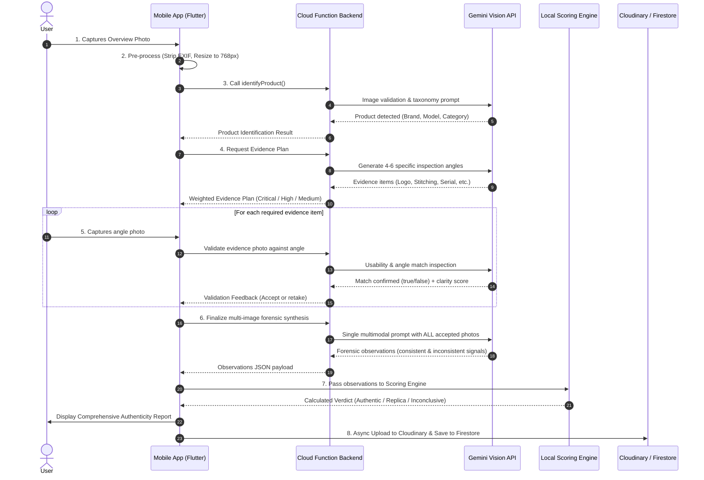

# Lenz (VeriCheck / Replica Detector) — Complete Project Documentation

> **Version:** 1.0.0+1  
> **Framework:** Flutter (Dart 3.x) & Firebase Cloud Functions (Node.js)  
> **Domain:** AI-Assisted Luxury Goods Authenticity & Replica Detection  

---

## 1. Executive Summary

**Lenz** (also referenced as *VeriCheck* / `replica_detector`) is an enterprise-grade mobile application designed to authenticate luxury and high-value consumer goods (luxury handbags, watches, sneakers, clothing, jewelry, and accessories). 

Unlike standard image-classification apps that provide arbitrary single-shot labels, Lenz utilizes a **multi-stage forensic inspection pipeline**. It combines state-of-the-art multimodal vision models (**Google Gemini 3.1 & 3.5 Flash Lite**) with a **deterministic, local scoring engine** and domain-specific knowledge bases to eliminate AI hallucination and produce auditable, defensible authenticity verdicts.

---

## 2. System Architecture & Tech Stack



### Technology Matrix

| Layer | Technology | Purpose |
| :--- | :--- | :--- |
| **Mobile Client** | **Flutter (Dart ^3.13.1)** | Cross-platform mobile UI for iOS and Android. |
| **State Management** | **Provider (`provider: ^6.1.5+1`)** | MVVM pattern separating UI, business logic, and data sources. |
| **Camera & Hardware** | **`camera`, `image_picker`, `local_auth`** | High-res camera capture, gallery selection, and biometric locking. |
| **Image Processing** | **`image: ^4.10.1`** | Client-side downsampling, EXIF metadata stripping, JPEG compression. |
| **Backend & Cloud** | **Firebase Cloud Functions (Node.js)** | Secure proxy protecting Gemini API keys, handling quotas and failovers. |
| **Authentication** | **Firebase Auth** | Anonymous guest sign-in, Google Sign-In, Apple Sign-In. |
| **Database** | **Cloud Firestore** | User profiles, scan history, custom collections, and category metadata. |
| **Media Hosting** | **Cloudinary (Unsigned Preset)** | Long-term high-resolution evidence photo hosting for saved reports. |
| **AI Inference** | **Gemini 3.1 / 3.5 Flash-Lite** | Multimodal identification, angle verification, and forensic observations. |
| **Scoring & Verification** | **Deterministic Scoring Engine (Dart)** | Pure math/rule engine calculating final verdicts to prevent AI hallucinations. |

---

## 3. The Lenz End-to-End AI Pipeline

The core intellectual property of Lenz is its **8-Stage Forensic Authentication Pipeline**:



### Detailed Pipeline Breakdown:

1. **Stage 1: Client-Side Image Preparation (`ImagePreparationService`)**
   - Automatically downsizes raw photos based on stage presets:
     - `identification`: Max 768px, 80% JPEG quality (fast, low bandwidth).
     - `validation`: Max 1024px, 82% JPEG quality.
     - `evidence`: Max 1280px, 86% JPEG quality (preserves stitch/engraving detail).
   - Strips all EXIF metadata for user privacy.

2. **Stage 2: Guardrail & Product Identification (`identifyProduct`)**
   - Validates that the photo is not too dark, blurry, blank, or an unparseable object.
   - Detects humans/faces and rejects selfies or portraits.
   - Rejects non-supported household clutter or general objects.
   - Identifies product category, visible brand, model, and baseline confidence.

3. **Stage 3: Dynamic Evidence Planning (`getRequiredEvidence`)**
   - Dynamically determines 4 to 6 critical physical checkpoints needed to verify that specific item (e.g. Rolex dial, cyclops magnifier, caseback, serial engraving).
   - Assigns priority weights: `critical`, `high`, `medium`, `low`.
   - Incorporates hardcoded category blueprints (`AuthenticationRules`) as a fallback if AI generation fails.

4. **Stage 4: Guided Angle Capture & Real-Time Validation (`validateEvidencePhoto`)**
   - User is guided with instructions on what angle to capture.
   - The photo is validated immediately: Did the user actually photograph the requested area?
   - Quality gates check for glare, blur, and distance before adding the image to the final evidence docket.

5. **Stage 5: Secure Cloud Function Proxy Gateway (`generateStructuredContent`)**
   - Client makes calls through an authenticated Firebase Callable Cloud Function.
   - `GEMINI_API_KEY` is securely fetched from Google Secret Manager.
   - Atomic quota and credit deduction: Decrements user scan credit only on finalization. If the AI call fails, credit is automatically refunded in Firestore.
   - Server-side model failover: If `gemini-3.1-flash-lite` experiences 429 rate limits or transient outages, it automatically fails over to `gemini-3.5-flash-lite`.

6. **Stage 6: Multi-Image Forensic Synthesis (`finalizeReport`)**
   - Combines all accepted angle photos into a **single multimodal payload**.
   - Gemini compares the images against each other to identify cross-image inconsistencies (e.g., mismatched finishes, variant discrepancies, font flaws).
   - **Crucial Rule:** Gemini is instructed to report purely objective observations and signals, *never* a final authenticity score.

7. **Stage 7: Deterministic Local Scoring Engine (`AuthenticationScoringEngine`)**
   - Pure Dart mathematical scoring system.
   - Requires minimum 75% weighted coverage, ≥3 accepted angles, and ≥4 consistent signals before "Likely Authentic" can be awarded.
   - Heavy penalties for detected replica tells and contradictions.
   - Caps confidence at 94% (acknowledging that photo-only inspection cannot guarantee 100% certainty).
   - Generates final verdicts: `Likely Authentic`, `Likely Replica`, or `Inconclusive`.

8. **Stage 8: Cloud Upload & Asynchronous Sync (`CloudinaryService` & `HistoryRepository`)**
   - High-res local images upload to Cloudinary in the background.
   - Local paths are swapped for HTTPS URLs so reports remain accessible across devices and sessions.
   - Final report is persisted to Firestore and local offline storage.

---

## 4. Codebase Directory Structure

```
lib/
├── core/
│   ├── config/
│   │   ├── cloudinary_config.dart        # Cloudinary cloud name & unsigned upload preset
│   │   ├── env_secrets.dart              # Local development secrets
│   │   └── gemini_config.dart            # Model settings, timeouts & retry parameters
│   ├── errors/
│   │   └── app_error.dart                # Centralized domain error types
│   └── theme/
│       ├── app_colors.dart               # Color tokens (Dark luxury theme)
│       ├── app_theme.dart                # Material ThemeData definition
│       └── app_typography.dart           # Font styles & text themes
│
├── data/
│   ├── authentication_rules.dart         # Category blueprints, inspection briefs & fallback rules
│   └── reference_library.dart            # Verified reference data for iconic models
│
├── models/
│   ├── authentication_result.dart        # AuthenticationReport, Verdict, ScoredEvidence
│   ├── category_item.dart                # Category representations
│   ├── collection_item.dart              # User saved collections
│   ├── evidence.dart                     # EvidenceItem, EvidenceWeight
│   ├── evidence_observation.dart         # Forensic observations & contradiction models
│   ├── evidence_plan.dart                # Checklist plan models
│   ├── evidence_validation.dart          # Per-photo validation results
│   ├── guide.dart                        # Authentication guides
│   ├── photo_quality.dart                # Image metrics (sharpness, lighting, framing)
│   ├── product.dart                      # Product taxonomy model
│   ├── product_identification.dart       # Presence check & category identification
│   └── user_profile.dart                 # User account, plan status & scan quota
│
├── repositories/
│   ├── authentication_repository.dart    # Abstract contract for auth verification
│   ├── gemini_authentication_repository.dart # Full Gemini prompt orchestration
│   ├── category_repository.dart          # Category exploration data
│   ├── collection_repository.dart        # User collections CRUD
│   ├── guide_repository.dart             # Static & dynamic verification guides
│   └── history_repository.dart           # Local & Firestore scan history storage
│
├── services/
│   ├── analytics_service.dart            # Firebase Analytics event logging
│   ├── auth_service.dart                 # Firebase Auth integration & lifecycle
│   ├── authentication_scoring_engine.dart# Deterministic scoring algorithm
│   ├── biometric_service.dart            # Face ID / Fingerprint app lock
│   ├── cloudinary_service.dart           # Cloudinary HTTP upload client
│   ├── data_migration_service.dart       # Local-to-cloud history synchronization
│   ├── gemini_service.dart               # Cloud Function client with retry logic
│   ├── home_tour_service.dart            # ShowcaseView app onboarding walkthrough
│   ├── image_preparation_service.dart    # Image resizing, EXIF stripping & base64
│   ├── image_quality_checker.dart        # Basic client-side contrast/blur checks
│   └── storage_service.dart              # SharedPreferences key-value wrapper
│
├── viewmodels/
│   ├── favorites_viewmodel.dart          # Bookmarked scan reports
│   ├── history_viewmodel.dart            # Scan history list, filters & search
│   ├── home_viewmodel.dart               # Dashboard stats, quick actions & guides
│   ├── onboarding_viewmodel.dart         # Intro walkthrough state
│   ├── profile_viewmodel.dart            # Account info, credits & app settings
│   └── scan_flow_viewmodel.dart          # Main scan lifecycle state machine
│
├── views/
│   ├── auth/                             # Login / Sign-up screen
│   ├── category/                         # Category browsing
│   ├── collection/                       # Saved items collection
│   ├── favorites/                        # Favorites view
│   ├── guides/                           # How-to authenticate guides
│   ├── history/                          # Scan history list & search
│   ├── onboarding/                       # First launch intro
│   ├── paywall/                          # Credit upgrade & guest paywall
│   ├── profile/                          # User profile, privacy & settings
│   ├── report/                           # Final authentication report views
│   └── scan/                             # Camera capture, quality review & progress
│
└── widgets/                              # Custom reusable UI components
    ├── animations/                       # Loaders, transitions & bounce buttons
    ├── camera/                           # Zoom controls & camera overlays
    ├── cards/                            # Glassmorphism cards & verdict badges
    ├── mascot/                           # Lenz detective mascot animations
    └── navigation/                       # Custom bottom navigation bar

functions/
├── index.js                              # Firebase Cloud Functions (Gemini Proxy)
├── package.json                          # Backend dependencies
└── node_modules/
```

---

## 5. Security & Privacy Architecture

1. **API Key Isolation:**
   - No Gemini API keys exist in client code.
   - The key is stored in **Google Cloud Secret Manager** (`GEMINI_API_KEY`) and accessed only within Cloud Functions.
2. **Transactional Quotas:**
   - Free/Guest users have limited scan credits (3 for guests, 5 for free accounts).
   - Credits are decremented inside a Firestore transaction.
   - If the AI request fails or times out, the backend automatically refunds the scan credit.
3. **Anonymous Scanning Mode:**
   - Supports an "Anonymous Scanning" privacy toggle.
   - All EXIF metadata (GPS location, device hardware, timestamp) is stripped before photos leave the device.
4. **Data Isolation:**
   - Firestore security rules restrict scan history documents so users can only read and write their own data.

---

## 6. How to Set Up & Deploy

### Prerequisites
- Flutter SDK (≥ 3.13.1)
- Node.js (≥ 18) & Firebase CLI
- Firebase Project with Blaze (Pay-as-you-go) Plan (required for Cloud Functions outbound network access)
- Cloudinary Account (for unsigned media uploads)

### Client Setup
1. Clone the repository.
2. Create `lib/core/config/env_secrets.dart` from the example:
   ```bash
   cp lib/core/config/env_secrets.example.dart lib/core/config/env_secrets.dart
   ```
3. Install Flutter dependencies:
   ```bash
   flutter pub get
   ```
4. Run the app:
   ```bash
   flutter run
   ```

### Backend Deployment (Firebase Cloud Functions)
1. Initialize Firebase CLI in the project:
   ```bash
   firebase use <your-firebase-project-id>
   ```
2. Store your Gemini API Key in Secret Manager:
   ```bash
   firebase functions:secrets:set GEMINI_API_KEY
   ```
3. Deploy functions and rules:
   ```bash
   firebase deploy --only functions,firestore:rules,storage:rules
   ```

---

## 7. Reusability for Other Apps

If you want to reuse this architecture for another inspection or verification app (e.g., auto damage appraisal, jewelry valuation, sneaker trading, or receipt scanning), reuse the following core modules:

1. **`lib/services/image_preparation_service.dart`**: Universal image compression and payload preparation.
2. **`functions/index.js` & `lib/services/gemini_service.dart`**: Secure AI proxy with Secret Manager integration, model failover, and credit management.
3. **`lib/services/authentication_scoring_engine.dart`**: Modularize the mathematical rules for your new domain.
4. **`lib/viewmodels/scan_flow_viewmodel.dart`**: Adapt the step-by-step state machine for your multi-step capture workflow.
